# Hi, I'm Gibo 👋

ML/AI Engineer focused on end-to-end machine learning pipelines —
from data analysis and model training to deployment and cloud infrastructure.

---

## Tech Stack

**Language**

**ML / AI**

**Backend**

**Infrastructure**

---

## GitHub Stats

  
  

---

## What I Do

- Data analysis & feature engineering
- Model training & optimization
- Model serving & inference infrastructure (KServe, Kubeflow)
- AI agent development
- Cloud infrastructure management (AWS EKS, Karpenter)
